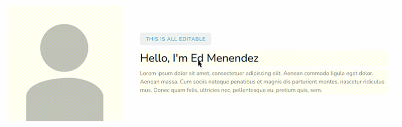

# Frontly

The easiest way to build views for Django. Without building any views!


Frontly allows you to make front-end changes to text and images without building custom views or using the admin. It can edit any field the ORM has access to. For example:

```html


<!-- Please see https://htmx.org/docs/#installing about the recommended way to install HTMX -->
<script src="https://unpkg.com/htmx.org@1.9.6" integrity="sha384-FhXw7b6AlE/jyjlZH5iHa/tTe9EpJ1Y55RjcgPbjeWMskSxZt1v9qkxLJWNJaGni" crossorigin="anonymous"></script>

<!-- This replaces {{ author.name }} -->
<h1><h1>
```

This will display what's in `auther.name` by default and, if you have the correct permissions, it will allow you to double-click and edit the field.


## INSTALLATION 🚀
You can install Frontly by using pip:

```bash
$ pip install django-frontly
```

Then add this to your settings.py:

```python
INSTALLED_APPS = (
    ...
    'frontly',
)
```

And add this to your main urls.py:

```python
urlpatterns = [
    ...
    path('frontly/', include('frontly.urls', namespace='frontly')),
]
```

## CONFIGURATION ⚙️

You can add these to you settings file.

```python
FRONTLY_CHECK_KILLSWITCH_PERM = True  # default
```

If `FRONTLY_CHECK_KILLSWITCH_PERM` is True (default), it will check to see if the user has the permission `frontly.frontly_killswitch`. If the permission is missing, they will not be able to make changes in the front-end.

**You will want to temporarily set to `False` while testing _only_.**

By default all input is sanitized using [nh3](https://github.com/messense/nh3). You can disable this by settings `FRONTLY_SANITIZE` to False in your settings.py.


## USAGE

Using Frontly in your existing application is designed to be very simple. It's template tags are designed to be a drop-in replacement, where you would normally output the context variable in your template.

Two things to keep in mind are:

* Always include [HTMX](https://htmx.org/docs/#installing) in your template. You can do this in a base template if you are using it everywhere.
* Always include `` to get access to the frontly tags.

The template tags currently available are: `fr_input`, `fr_textarea`, `fr_img`. PRs for additional editing widgets are welcome.

### EXAMPLES

```html

```

#### fr_img example:
   * request.user - used to check permissions.
   * instance     - the django model instance you are working on.alt
   * field        - the name of the field within the model. Note that you can have a JSONField and refer
                    to a value deep within the json. i.e. user.misc_json.key
   * default      - A default value to display if the field is null.

Anything else passed to the template tag will passed directly to the html field. In this example `class` is passed directly to the  field.

### SECURITY

Row level security is handled by `model_instance.frontly_permission_check()`. Returning True will allow the editing to happen.

Add this to your models:
```python
    def frontly_permission_check(self, user):
        """ Check if a certain user has permission to do this.
        """
        return self.user == user
```

## FEATURES

*   Allow for simple front-end editing.
*   Built-in support for `input`, `textarea` and `image` types.
*   Ability to customize additional editor types.
*   Row level security

## CONTRIBUTING

We welcome PRs for new editor types and new features. If you get stuck, please open an issue so that we can improve the documentation.

If you find a bug :bug:, please open a [bug report](https://github.com/edmenendez/django-frontly/issues/new?assignees=&labels=bug&template=bug_report.md&title=).
If you have an idea for an improvement or new feature :rocket:, please open a [feature request](https://github.com/edmenendez/django-frontly/issues/new?assignees=&labels=Feature+request&template=feature_request.md&title=).


### AUTHORS & ACKNOWLEDGEMENTS

*   Ed Menendez
*   The HTMX Project
*   Trix Project

### LICENSE

This project is licensed under the MIT License
